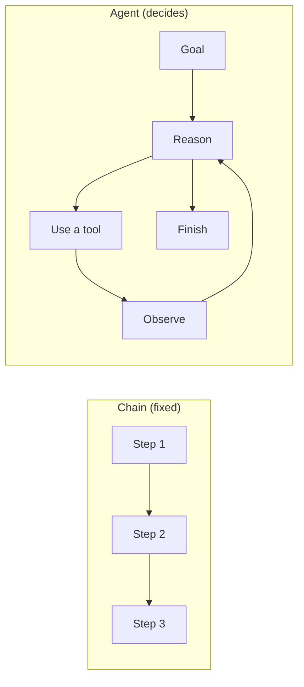
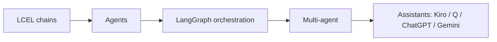

import TOCInline from '@theme/TOCInline';

# 08 · Agents & Agentic AI

<ProgressToggle sectionId="08-agentic-ai" />

<TOCInline toc={toc} minHeadingLevel={2} maxHeadingLevel={2} />

:::tip[In this guide]
Move beyond fixed pipelines to systems that **decide** what to do next. Learn
agent fundamentals, build real agents with LangGraph, orchestrate multiple
agents, and reverse-engineer how assistants like Kiro, Amazon Q, ChatGPT, and
Gemini are actually built — then build your own.
:::

## Goal

Understand how agentic systems work and build them step by step, from a single
tool-using agent to a mini coding assistant.

## Estimated Time

2–3 weeks.

## Prerequisites

- [LangChain / LCEL](../07-langchain-lcel/index.mdx) — especially [memory & agents](../07-langchain-lcel/02-memory-agents.mdx).
- A working [RAG project](../05-rag-fundamentals/03-first-project.mdx) (agents will use retrieval as a tool).
- [Production guardrails](../09-production-patterns/02-logging-monitoring-guardrails.mdx) awareness — agents need limits.

## What You Will Learn

1. [Agent Fundamentals](./01-agents-fundamentals.mdx) — what an agent is, the reason→act→observe loop, tools, autonomy levels.
2. [LangGraph Basics](./02-langgraph-basics.mdx) — state, nodes, edges, and cycles; why graphs beat linear chains for agents.
3. [Building Agents](./03-building-agents.mdx) — a tool-calling agent and a RAG agent, step by step, with guardrails.
4. [Multi-Agent Systems](./04-multi-agent-systems.mdx) — supervisor, hierarchical, and handoff patterns.
5. [How Assistants Work](./05-how-assistants-work.mdx) — the architecture behind Kiro, Amazon Q, ChatGPT, and Gemini.
6. [Build a Coding Assistant](./06-build-coding-assistant.mdx) — a mini agentic assistant with tools and safety.

## Chains vs Agents

A chain runs the same steps every time. An **agent** loops: it reasons, picks a
tool, observes the result, and repeats until the goal is met.

## Where This Fits

## Interview Relevance

"What is an agent?", "chain vs agent", "how does tool-calling work?", "how would
you build a coding assistant?", and "how do you keep agents safe?" are
increasingly common. Each page ends with an interview section.

## Done When

- [ ] You can explain the agent loop and tool-calling.
- [ ] You can build a stateful agent with LangGraph.
- [ ] You can describe a multi-agent architecture.
- [ ] You can explain how a real assistant (e.g. Kiro) is built.
- [ ] You've built a small agentic assistant with guardrails.

Next: [09 · Production Patterns](../09-production-patterns/index.mdx).
