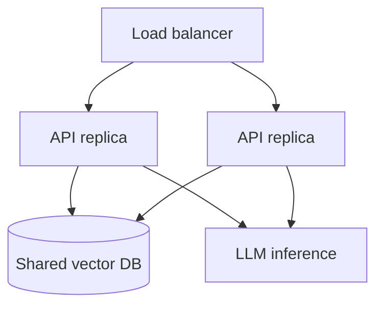

import TOCInline from '@theme/TOCInline';

# Deployment Basics

<TOCInline toc={toc} minHeadingLevel={2} maxHeadingLevel={2} />

:::tip[In this guide]
Package the RAG API into a container, configure it per environment, and
understand the scaling levers — the concepts, without committing to a provider.
:::

:::note[Scope]
This roadmap doesn't pick a hosting provider. When you're ready to deploy for
real, decide the target (a VM, a container platform, a managed service) and
we'll tailor the steps then.
:::

## What Is It?

Deployment is packaging your app and its dependencies so it runs reliably
outside your laptop, configured per environment.

## Why Does It Matter?

"Works on my machine" isn't a deployment. Containers + externalized config make
runs reproducible and portable.

## Containerize with Docker

```dockerfile
FROM python:3.12-slim

WORKDIR /app
ENV PYTHONUNBUFFERED=1

COPY requirements.txt .
RUN pip install --no-cache-dir -r requirements.txt

COPY app ./app
EXPOSE 8000
CMD ["uvicorn", "app.main:app", "--host", "0.0.0.0", "--port", "8000"]
```

```bash
docker build -t rag-api .
docker run -p 8000:8000 --env-file .env rag-api
```

:::tip
Add a `.dockerignore` (exclude `.venv`, `chroma/`, `__pycache__`, `.git`) to
keep images small and builds fast.
:::

### Local multi-service with Compose

Ollama + your API can run together (Ollama typically runs on the host or its
own container). Point `OLLAMA_URL` at the right address, and mount a volume so
the Chroma directory persists across restarts.

## Environments & Config

Same image, different config via environment variables:

| Env | Traits |
| --- | --- |
| dev | verbose logs, small model, local Chroma |
| staging | prod-like, test data |
| prod | strict CORS, secrets from a manager, monitoring on |

Never bake secrets into the image; inject them at runtime.

## Health & Readiness in Deployment

Orchestrators use these to route traffic and restart bad instances (from
[Docker & deployment](../02-fastapi/19-docker-deployment.mdx)):

- **Liveness (`/health`)**: restart the container if this fails.
- **Readiness (`/ready`)**: only send traffic when dependencies (Chroma, Ollama) are reachable.

## Scaling Concepts

- **Stateless API**: keep request state out of the process so you can run many replicas behind a load balancer.
- **Externalize state**: the vector store and cache live outside the API replicas (shared Chroma/Redis) so scaling out works.
- **Separate ingestion from serving**: heavy ingestion shouldn't compete with low-latency `/ask` traffic — run it as a separate job/worker.
- **The model is the bottleneck**: LLM inference dominates latency/cost. Scale it independently (dedicated inference hosts/GPUs) and cache aggressively.



## Common Mistakes

- Secrets baked into images or committed.
- Stateful API instances that can't scale horizontally.
- Ingestion running inside the serving process, spiking latency.
- No readiness check → traffic hits a not-ready instance.

## Interview Questions

- Why containerize? What goes in a Dockerfile for a Python API?
- How do you manage config across environments?
- How would you scale a RAG service? What's the bottleneck?
- Why separate ingestion from serving?

## Things to Remember

- One image, env-driven config, runtime secrets.
- Stateless API + externalized state = horizontal scaling.
- Scale (and cache) the LLM separately; split ingestion from serving.

## Mini Exercise

Write a Dockerfile and `.dockerignore` for your RAG API, build the image, and
run it with an `--env-file`, confirming `/health` responds.

## Done When

- [ ] The service builds and runs in Docker.
- [ ] Config comes from environment variables per environment.
- [ ] You can explain how you'd scale each component.
