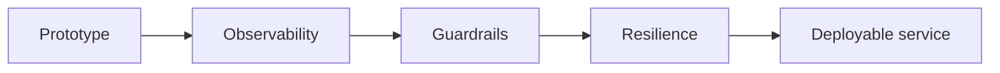

import TOCInline from '@theme/TOCInline';

# 09 · Production Patterns

<ProgressToggle sectionId="09-production-patterns" />

<TOCInline toc={toc} minHeadingLevel={2} maxHeadingLevel={2} />

:::tip[In this guide]
Turn the working RAG API into something you'd actually operate: observable,
resilient, safe, and deployable.
:::

## Goal

Add the operational concerns that separate a demo from a service.

## Estimated Time

1–2 weeks.

## Prerequisites

- [RAG project](../05-rag-fundamentals/03-first-project.mdx) and [Advanced RAG](../06-advanced-rag/index.mdx).
- [FastAPI production design](../02-fastapi/10-api-design-production.mdx).

## What You Will Learn

1. [API & Service Design](./01-api-service-design.mdx) — config, resilience (timeouts, retries), caching, connection reuse.
2. [Logging, Monitoring & Guardrails](./02-logging-monitoring-guardrails.mdx) — structured logs, metrics, tracing, prompt-injection defenses, input/output validation.
3. [Deployment Basics](./03-deployment-basics.mdx) — Docker, environments, health checks, scaling concepts.

## How It Evolves

## Interview Relevance

"How would you productionize this?", prompt injection, caching, and
observability are common senior-level AI-engineering questions.

## Done When

- [ ] Config, logging, and metrics are in place.
- [ ] Guardrails validate inputs and outputs.
- [ ] Timeouts, retries, and caching protect the service.
- [ ] It runs in a container with health/readiness checks.

Next: [10 · System Design & Interview](../10-system-design-interview/index.mdx).
