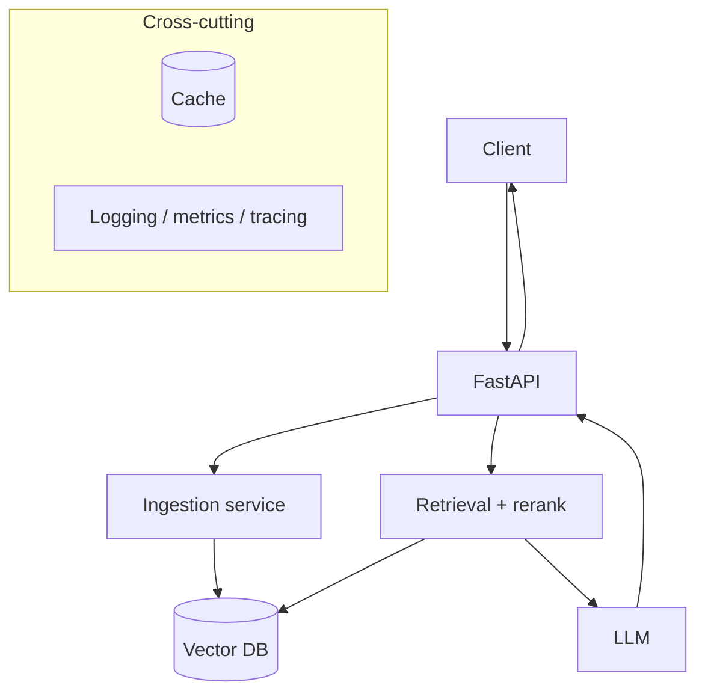

import TOCInline from '@theme/TOCInline';

# Architecture Narratives

<TOCInline toc={toc} minHeadingLevel={2} maxHeadingLevel={2} />

:::tip[In this guide]
A structured way to design and narrate a RAG system so you never freeze at the
whiteboard. We apply the framework to "design a document Q&A system."
:::

## What Is It?

A repeatable 10-part structure for presenting any AI system design clearly and
completely.

## Why Does It Matter?

Interviewers assess structured thinking. A consistent narrative shows you can
reason about requirements, tradeoffs, and failure — not just recite components.

## The Framework

1. Requirements
2. High-level architecture
3. Data flow
4. APIs
5. Storage
6. Scaling
7. Bottlenecks
8. Trade-offs
9. Failure scenarios
10. Interview discussion points

## Worked Example: Document Q&A (RAG)

### 1. Requirements

- **Functional**: ingest documents; ask questions; get grounded answers with citations.
- **Non-functional**: p95 latency < ~3s; hundreds of concurrent users; private/local data; bounded cost.
- **Clarify**: corpus size? update frequency? languages? who can see which docs?

### 2. High-level Architecture



### 3. Data Flow

- **Ingest**: document → chunk → embed → store (chunk + vector + metadata). Offline/async.
- **Ask**: question → embed → retrieve top-N → rerank → build prompt → LLM → answer + citations.

### 4. APIs

```text
POST /ingest   { documents[] }        -> { chunks_added }
POST /ask      { question, top_k }     -> { answer, sources[] }
GET  /health   -> liveness
GET  /ready    -> dependency readiness
```

### 5. Storage

- **Vector DB** for chunks + embeddings + metadata (Chroma locally; pgvector/managed at scale).
- **Object store / DB** for raw documents and ingestion metadata (hashes, versions).
- **Cache** (Redis) for embeddings and answers.

### 6. Scaling

- Stateless API replicas behind a load balancer.
- Shared vector DB + cache.
- Separate ingestion workers from serving.
- Scale LLM inference independently (the bottleneck); cache aggressively.

### 7. Bottlenecks

- **LLM inference** dominates latency and cost.
- **Embedding** at ingest time for large corpora.
- **Vector search** at very large scale (index tuning, sharding).

### 8. Trade-offs

- RAG vs fine-tuning; chunk size (context vs precision); top-k (recall vs noise/cost); reranking (quality vs latency); local vs hosted models. See [Tradeoff Discussions](./02-tradeoff-discussions.mdx).

### 9. Failure Scenarios

- Vector DB down → `/ready` fails, degrade or shed load.
- LLM slow/unavailable → timeout + friendly error; optionally a cached/fallback answer.
- Bad retrieval → answer "I don't know"; log for eval.
- Prompt injection via documents → treat context as data, restrict tools.

### 10. Interview Discussion Points

- How to keep answers grounded and cited.
- How to evaluate quality over time.
- Cost controls (caching, model choice, top-k).
- Multi-tenant isolation (per-tenant filters/collections).

## Common Mistakes

- Jumping to components before clarifying requirements.
- Ignoring non-functional needs (latency, cost, privacy).
- No failure story.
- Hand-waving scale ("just add servers") without naming the bottleneck.

## Interview Questions

- Design a document Q&A system. Walk through your framework.
- Where's the bottleneck and how do you address it?
- How do you keep answers grounded and cited?
- How would you make it multi-tenant?

## Things to Remember

- Requirements first; state assumptions out loud.
- Name the bottleneck (usually the LLM) and design around it.
- Always include a failure story.

## Mini Exercise

Apply the 10-part framework to "design a customer-support assistant over a
company knowledge base." Sketch the architecture and list three tradeoffs.

## Done When

- [ ] You can narrate the 10-part framework from memory.
- [ ] You can draw the RAG architecture and its data flows.
- [ ] You can name bottlenecks and failure handling.
