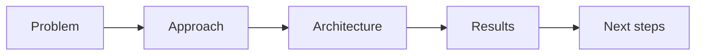

import TOCInline from '@theme/TOCInline';

# Portfolio

<TOCInline toc={toc} minHeadingLevel={2} maxHeadingLevel={2} />

:::tip[In this guide]
A finished project only helps if others can understand it fast. Package the RAG
API so a reviewer grasps what you built, why, and how well it works — in two
minutes.
:::

## What Is It?

The presentation layer around your work: a clear README, architecture diagram,
evaluation results, and a runnable demo.

## Why Does It Matter?

Interviewers skim. A crisp portfolio turns "I built a RAG app" into demonstrable
evidence of backend + AI engineering skill.

## What to Include

### 1. A Strong README

- **One-liner**: what it does and for whom.
- **Architecture diagram** (reuse your Mermaid from the [first project](../05-rag-fundamentals/03-first-project.mdx)).
- **Quickstart**: clone → install → `ollama pull` → run → curl `/ingest` and `/ask`.
- **API reference**: the three endpoints with example requests/responses.
- **Design decisions**: chunking, top-k, reranking, local model — with the "why".
- **Evaluation results**: recall@k / MRR / faithfulness before vs after improvements.
- **Limitations & next steps**: honesty reads as senior.

### 2. Clean, Layered Code

The router/service/repository structure from
[production design](../02-fastapi/10-api-design-production.mdx) signals you can
build maintainable systems, not just scripts.

### 3. Tests

A few meaningful [tests](../02-fastapi/09-testing-fastapi.mdx) (endpoint + a
service unit test) show engineering discipline.

### 4. A Demo

A short screen recording or a handful of `curl` examples with real output.
Optionally a tiny web UI.

## Framing the Narrative

Structure your write-up (and your verbal pitch) as:

Lead with the problem, not the tech.

## Talking About It

Rehearse a 2-minute walkthrough:

1. The problem and requirements.
2. The architecture (draw it).
3. One hard tradeoff and how you decided.
4. How you measured quality.
5. What you'd do next.

## Common Mistakes

- README that's only install steps, no "why".
- No evaluation numbers ("it works well" isn't evidence).
- Committing secrets or a giant `chroma/` directory.
- Overclaiming — reviewers probe, and honesty wins.

## Interview Questions

- Walk me through a project you're proud of.
- What was the hardest tradeoff and how did you decide?
- How do you know it works well?
- What would you improve with more time?

## Things to Remember

- Lead with the problem; show the architecture.
- Include evaluation numbers and design rationale.
- Keep the repo clean; make it runnable in minutes.

## Mini Exercise

Write the README for your RAG project including the architecture diagram, a
quickstart, your design decisions, and a small before/after evaluation table.

## Done When

- [ ] Your repo has a clear, complete README with diagrams.
- [ ] Design decisions and evaluation results are documented.
- [ ] You can give a confident 2-minute walkthrough.

You've reached the end of the core roadmap. Explore [11 · Optional Extensions](../11-optional-extensions/index.mdx) next.
